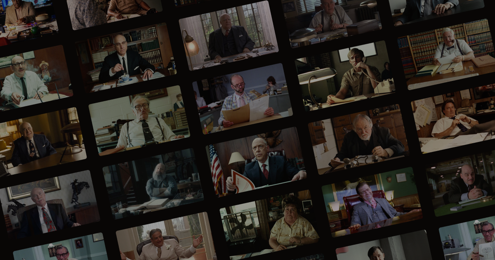

This is a website that documents all the scenes in the Coen Brothers' filmography that feature a character actor sitting behind a desk or a desk-like piece of furniture.

It's built with [Gatsby](https://www.gatsbyjs.org/), a static site generator that uses React and GraphQL.

Gatsby's image processing features (with [`gatsby-transformer-sharp`](https://www.gatsbyjs.org/packages/gatsby-transformer-sharp/) and [`gatsby-plugin-sharp`](https://www.gatsbyjs.org/packages/gatsby-plugin-sharp/)) are very cool and kind of revolutionary, and this site makes good use of them.

Styling is done with [`Emotion`](https://github.com/emotion-js/emotion), a CSS-in-JS library, and [`Rebass`](https://rebassjs.org/), CSS-in-JS component library.

Some animation/transition effects are accomplished with [`react-spring`](https://www.react-spring.io/) and [`react-flip-toolkit`](https://github.com/aholachek/react-flip-toolkit).

### Running the site locally

```
yarn install
yarn develop
```

### building the static files

```
yarn build
```

[](https://app.netlify.com/sites/coens/deploys)
